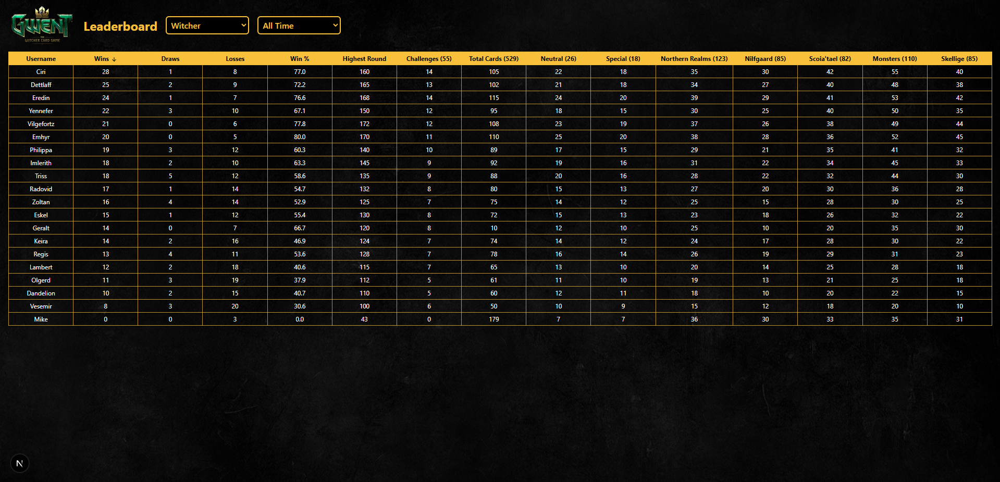

# Gwent Leaderboard

The application is deployed on Vercel and can be viewed [here](https://gwent-leaderboard.vercel.app/).

## About the project

A Next.js web application that displays leaderboards for my Gwent JavaFX game. Users can view player stats, filter by time range, and see progress on cards and challenges. The UI updates dynamically based on the selected game version.

#### Features

- Display leaderboards with sortable columns (Wins, Draws, Losses, Win %, etc.).
- Filter by time ranges: All Time, Today, Past Week, Past Month.
- Supports multiple game versions of Gwent: Witcher, Game of Thrones and Lord of the Rings.
- Dynamic colour theme and logos based on selected game version.
- Responsive table with hover effects.

#### Preview



## Setup

#### Dependencies

- [Vercel Postgres](https://vercel.com/docs/postgres) for data storage.
- [TanStack React Table](https://tanstack.com/table/latest) for table rendering.
- [Lucide React](https://lucide.dev/guide/packages/lucide-react) for icons.

#### Getting Started

This is a [Next.js](https://nextjs.org) project bootstrapped with [`create-next-app`](https://nextjs.org/docs/app/api-reference/cli/create-next-app).

First, run the development server:

```bash
npm run dev
# or
yarn dev
# or
pnpm dev
# or
bun dev
```

Open [http://localhost:3000](http://localhost:3000) with your browser to see the result.

You can start editing the page by modifying `app/page.tsx`. The page auto-updates as you edit the file.
